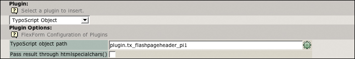
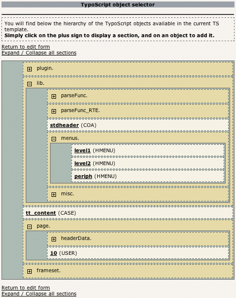

.. ==================================================
.. FOR YOUR INFORMATION
.. --------------------------------------------------
.. -*- coding: utf-8 -*- with BOM.

.. include:: ../Includes.txt

.. _users-manual:

Users manual
============

.. _users-manual-installation:

Installation
------------

The installation of this extension is very simple. Just connect to the TYPO3 Extension Repository and download
"Content Element From TypoScript" (tscobj), located in the frontend plugin section.

Then, on a page, just create a new content element, and choose "TypoScript" from the wizard.

.. image:: ../Images/plugins.jpg
	:alt: New content element of type "TypoScript"

.. _users-manual-usage:

Usage
-----

Once you have created the plugin, you'll be able to enter to path of the TypoScript object you want to display.

If you click on the little gear on the right of the field, you'll launch a wizard that will show you all the available
template objects. You can select one just by clicking on its name.

.. note::
	Only the objects which can be rendered are displayed here.

The htmlspecialchars checkbox can be used if you want to see the object HTML code on your page (it won't be interpreted
by the browser). This feature can be helpful for developers.
